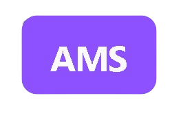
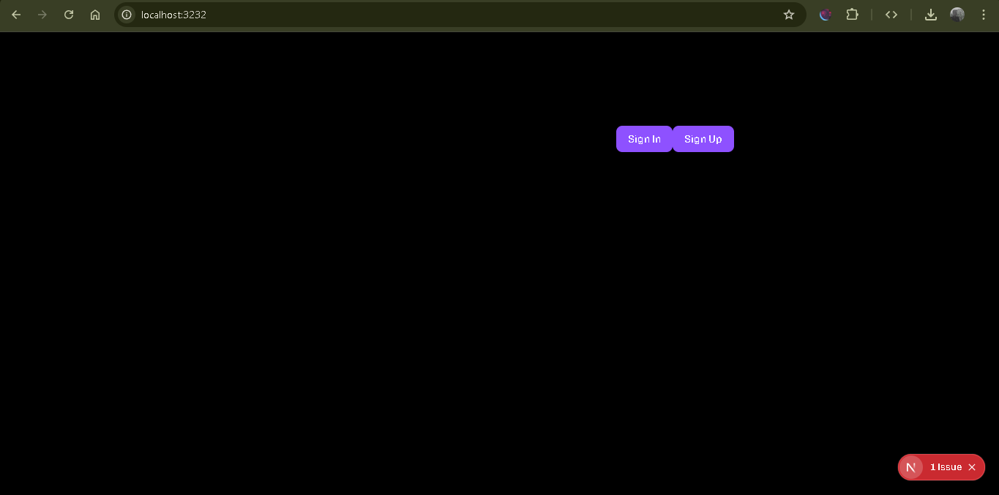
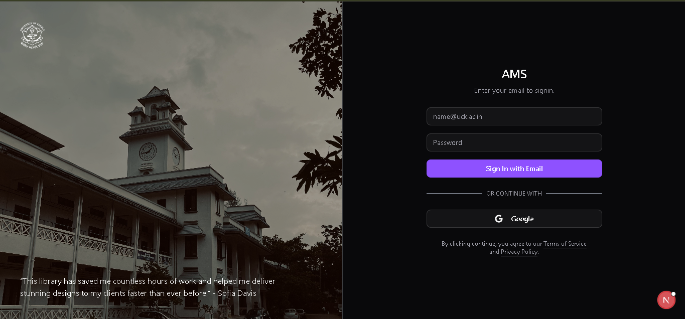
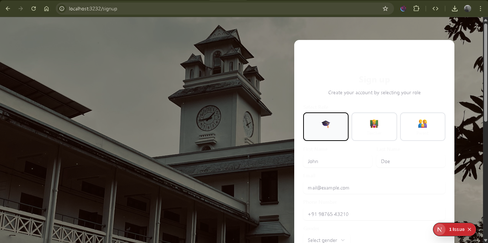

<div align="center">
  
  

  [](LICENSE)
  [](https://github.com/mulearnucek/ams-frontend)
  
</div>

## 📋 Overview
> **⚠️ Note**: This project is currently under active development. Features and functionality may change.

The UCEK Attendance Management System is a comprehensive platform developed by the μLearn UCEK. This application streamlines academic tracking and management for students, teachers, and parents, providing real-time access to attendance records, grades, assignments, and more.

  #### 🌐 [Visit Live Website](https://ams.mulearn.uck.ac.in/) (dev)

## ✨ Features

### 👨‍🎓 For Students
- **Attendance Tracking**: View real-time attendance records across all subjects
- **Grade Management**: Access current grades and academic performance
- **Assignment Tracker**: Keep track of pending and submitted assignments
- **Timetable Access**: View class schedules and exam timetables
- **Notifications**: Receive alerts for low attendance, upcoming deadlines, and announcements
- **Performance Analytics**: Visual representation of academic progress

### 👨‍🏫 For Teachers
- **Attendance Logging**: Quick and efficient attendance marking system
- **Marksheet Publishing**: Upload and publish student grades and assessments
- **Assignment Management**: Create, assign, and track student assignments
- **Student Analytics**: View individual and class-wide performance metrics
- **Bulk Operations**: Perform actions for multiple students simultaneously
- **Report Generation**: Generate attendance and performance reports

### 👪 For Parents
- **Real-time Monitoring**: Track child's attendance and academic performance
- **Progress Reports**: Access detailed academic progress reports
- **Notification System**: Receive alerts about attendance, grades, and important updates
- **Communication Channel**: Direct communication with teachers and administration
- **Historical Data**: View past performance trends and records

## 📸 Screenshots






## 🚀 Getting Started

### Prerequisites
- Node.js (v14 or higher)
- npm or yarn

### Installation

```bash
# Clone the repository
git clone https://github.com/mulearnucek/ams-frontend.git

# Navigate to project directory
cd ams-frontend

# Install dependencies
npm install

# Start the development server
npm run dev
```

### Environment Variables

Create a `.env` file in the root directory:

```env
NEXT_PUBLIC_API_URL=api.example.com
```

## 🛠️ Technology Stack

- **Frontend**: React.js / Next.js / Node.js
- **Backend**: Fastify / Node.js
- **Database**: MongoDB
- **UI Framework**: Shadcn Ui / Tailwind CSS

## 📱 User Roles & Permissions

| Feature | Student | Teacher | Parent | Admin |
|---------|---------|---------|--------|-------|
| View Attendance | ✅ | ✅ | ✅ | ✅ |
| Mark Attendance | ❌ | ✅ | ❌ | ✅ |
| View Grades | ✅ | ✅ | ✅ | ✅ |
| Publish Grades | ❌ | ✅ | ❌ | ✅ |
| Manage Assignments | ✅ | ✅ | ✅ | ✅ |
| System Configuration | ❌ | ❌ | ❌ | ✅ |

## 📖 User Guide

### For Students
1. Login with your enrollment number and password
2. Navigate to Dashboard to view overall statistics
3. Click on "Attendance" to see subject-wise attendance
4. Access "Grades" section for marks and assessments
5. Check "Assignments" for pending tasks and deadlines

### For Teachers
1. Login with your faculty credentials
2. Select the class/section from the dashboard
3. Mark attendance using the quick-entry interface
4. Upload marks through the "Marksheet" section
5. Create and manage assignments from the "Assignments" tab

### For Parents
1. Login using provided parent credentials
2. View your child's attendance summary
3. Access detailed performance reports
4. Set up notification preferences
5. Contact teachers through the messaging system

## 🤝 Contributing

We welcome contributions from the UCEK community! Please read our [Contributing Guidelines](CONTRIBUTING.md) before submitting pull requests.

1. Fork the repository
2. Create your feature branch (`git checkout -b feature/AmazingFeature`)
3. Commit your changes (`git commit -m 'Add some AmazingFeature'`)
4. Push to the branch (`git push origin feature/AmazingFeature`)
5. Open a Pull Request


<div align="center">
  Made with ❤️ by μLearn UCEK
  
  [Report Bug](https://github.com/mulearnucek/ams-frontend/issues) · [Request Feature](https://github.com/mulearnucek/ams-frontend/issues)
</div>
